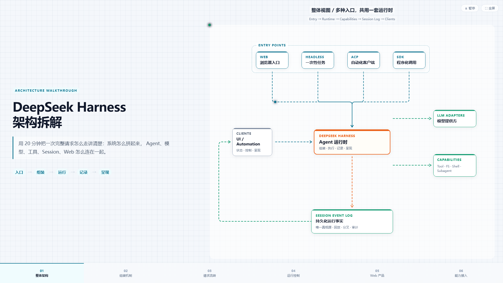

<div align="center">

# motion-arch-slide

[**简体中文**](README.zh-CN.md) · [English](README.md)

**Full-viewport HTML slides with animated architecture diagrams — zero build, open in browser.**

CSS dashed flows · SVG light-dot journeys · semantic node colors · Cursor Agent Skill

<br />

[](LICENSE)
[](https://jiruibabaya.github.io/motion-arch-slide/)
[](SKILL.md)

[**Live demo**](https://jiruibabaya.github.io/motion-arch-slide/demo/deepseek-harness-v3.html) · [Design spec](DESIGN.md) · [Agent workflow](SKILL.md)

</div>

---

## Preview

<p align="center">
  
</p>

<p align="center">
  <sub>Example: <code>slides/deepseek-harness-v3.html</code> — DeepSeek Harness architecture walkthrough</sub>
</p>

---

## Why this exists

Most “animated diagram” demos are either **dark landing pages** or **heavy JS timelines**.  
This project targets **screen-recording explainer slides**:

| You get | You don’t need |
|---|---|
| 100vw × 100vh PPT-style layout | Webpack / Vite |
| Orthogonal edges + flowing dashes | GSAP / Lottie |
| Semantic colors (entry / core / cap) | A diagram SaaS export |
| Single HTML file per chapter | A slide deck toolchain |

Inspired by editorial tech walkthroughs (e.g. DeepSeek Harness breakdown style), distilled into a **reusable template + Cursor Skill**.

---

## Features

- **Layout** — 40% narrative · animated canvas · bottom chapter bar · global grid background
- **Motion** — CSS `stroke-dashoffset` loops + SVG `animateMotion` journey dots
- **Semantics** — Cyan entry · orange core · green capabilities · gray clients ([color map](references/semantic-colors.md))
- **Routing** — Orthogonal paths, side lanes for loops; paths recalc on resize
- **A11y** — `prefers-reduced-motion`, Space to pause, F for fullscreen
- **Agent-ready** — [SKILL.md](SKILL.md) documents when to use architecture vs flowchart vs sequence diagrams

---

## Quick start

```bash
git clone https://github.com/jiruibabaya/motion-arch-slide.git
cd motion-arch-slide
```

Open the reference slide in any modern browser:

- **Online:** [GitHub Pages demo](https://jiruibabaya.github.io/motion-arch-slide/demo.html)
- **Local file:** `slides/deepseek-harness-v3.html`

Or serve locally:

```bash
python -m http.server 8765
# http://127.0.0.1:8765/slides/deepseek-harness-v3.html
```

### Create your own slide

1. Copy `templates/slide-architecture.html` → `slides/my-topic-v1.html`
2. Edit left narrative, `.node[data-id]`, footer chapters, and `layout()` edges
3. Run through the [acceptance checklist](DESIGN.md#验收清单)

---

## Cursor Skill

Install for global Agent use:

```text
~/.cursor/skills/motion-arch-slide/
  ├── SKILL.md
  ├── DESIGN.md
  ├── references/
  └── templates/
```

Copy from this repo, then `@motion-arch-slide` in chat. The skill encodes **diagram type selection**, **color semantics**, and **layout traps to avoid** (e.g. never `backdrop-filter` on canvas — alpha tweaks become invisible).

---

## Project structure

```
motion-arch-slide/
├── assets/preview.png          # README hero
├── slides/                     # Finished slides
├── templates/                  # Copy & customize
├── references/                 # Diagram types, colors, animation contract
├── scripts/capture_preview.py  # Regenerate hero screenshot
├── SKILL.md                    # Cursor Agent instructions
└── DESIGN.md                   # Hard constraints + QA checklist
```

---

## Diagram guide (short)

| Intent | Diagram | See |
|---|---|---|
| Components & connections | Architecture | [diagram-types.md](references/diagram-types.md) |
| Step-by-step process | Flowchart | same |
| Request timeline across roles | Sequence | same |
| Pods / regions / hosts | Deployment | same |

Default for backend / agent / platform talks: **architecture slide**.

---

## GitHub Pages

Site source: **`docs/`** (also auto-synced to **`gh-pages`** branch on every push).

**If you see 404 — enable Pages once:**

1. Open repo **Settings → Pages**
2. **Build and deployment → Source:** Deploy from a branch
3. **Branch:** `gh-pages` · **Folder:** `/ (root)` → Save

(Alternative: branch `main`, folder `/docs`.)

| URL | Content |
|---|---|
| [jiruibabaya.github.io/motion-arch-slide/](https://jiruibabaya.github.io/motion-arch-slide/) | Bilingual landing (default **中文**) |
| […/demo.html](https://jiruibabaya.github.io/motion-arch-slide/demo.html) | Reference slide |

After updating `slides/deepseek-harness-v3.html`, run `scripts/sync-pages-demo.bat` and push.

---

## Credits & references

Built on ideas from open diagram animation work:

- [dashmotion](https://github.com/csthink/dashmotion) — dash timing & semantic strokes
- [abergs/animations](https://github.com/abergs/animations) — orthogonal edge patterns

---

## License

[MIT](LICENSE) © 2026 [jiruibabaya](https://github.com/jiruibabaya)
